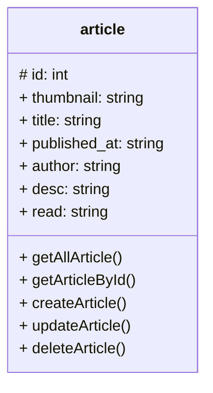

## API POINTS

Berikut adalah api point yang digunakan untuk membangun portfolio saya menggunakan article


## Article

> getAllArticle()

getAllArticle merupakan fungsi untuk mengambil semua data article untuk ditampilkan dari server

```
GET: /article

response:
[
    {
        "id"                    : "",
        "thumbnail"             : "",
        "title"                 : "",
        "published_at"          : "",
        "author"                : "",
        "desc"                  : "",
        "read"                  : ""
    }
    ...
]
```

> getArticleById()

getArticleById merupakan fungsi untuk mengambil data article berdasarkan `id` tertentu

```
GET: /article/[id]

response:
{
    "id"                    : "",
    "thumbnail"             : "",
    "title"                 : "",
    "published_at"          : "",
    "author"                : "",
    "desc"                  : "",
    "read"                  : ""
}
```

> createArticle()

createArticle merupakan fungsi untuk membuat data article baru yang akan disimpan pada server database

```
POST: /article

headers:
{
    Content-type: 'application/json',
    Authorization: 'Bearer [access_token]'
}

body:
{
    "id"                    : "",
    "thumbnail"             : "",
    "title"                 : "",
    "published_at"          : "",
    "author"                : "",
    "desc"                  : "",
    "read"                  : ""
}

response:
true    // if success
false   // if failure
```

> updateArticle()

updateArticle merupakan fungsi untuk mengubah data pada article

```
PUT: /article

headers:
{
    Content-type: 'application/json',
    Authorization: 'Bearer [access_token]'
}

body:
{
    "id"                    : "",
    "thumbnail"             : "",
    "title"                 : "",
    "published_at"          : "",
    "author"                : "",
    "desc"                  : "",
    "read"                  : ""
}

response:
true    // if success
false   // if failure
```

> deleteArticle()

deleteArticle adalah fungsi untuk menghapus article dari data server

```
DELETE: /article/[id]

headers:
{
    Content-type: 'application/json',
    Authorization: 'Bearer [access_token]'
}

response:
true    // if success
false   // if failure
```

## Desain Database

berikut adalah desain database yang digunakan untuk membangun portfolio saya


